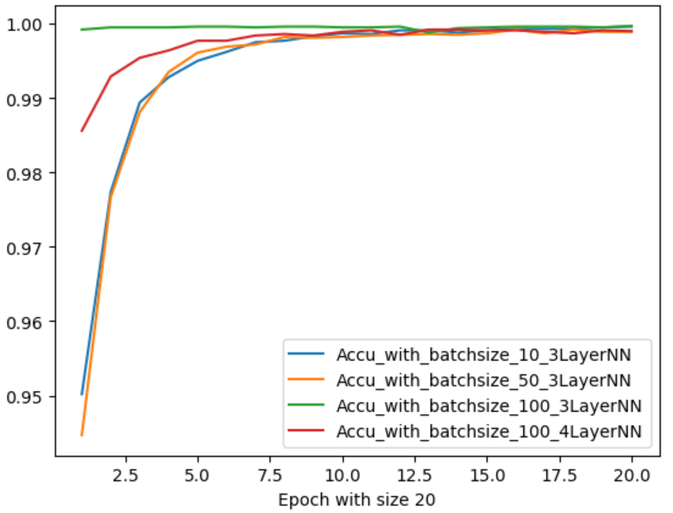
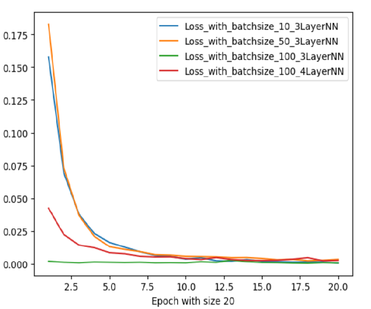

# Text_Classification using Tensorflow 2.0 (Keras)

This is a quick introduction to use tensorflow for image classification problem. Here are the steps to follow

1. Load train and test data

2. Clean and Preprocess the text data 

3. Tokenize the text to feed to the model

4. Add padding text sequence 

5. Split train and test data 

6. Train the model using training data with adam optimizer and binary cross_entropy loss

7. Get the model prediction on new test data

# Results

Train accuracy 97.8% with  0.0703 loss

# Observations

 
 
  
  From the above plot, we can observe that the model converges faster with larger batch size with relatively higher accuracy and lower loss in the first few epochs.
  
  ## Observation with additional Neural Network Layer
  

From the above plot, we can observe that the model accuracy or loss does not have impact with additional layers of neural network, so we can consider the results from the above plot with 3 layers of neural networks. From the graph, we can observe that 3 layers of neural network is sufficient for this dataset as adding additional network layers have similar results.
  
 # References:

1) https://www.analyticsvidhya.com/blog/2020/03/tensorflow-2-tutorial-deep-learning/

'
